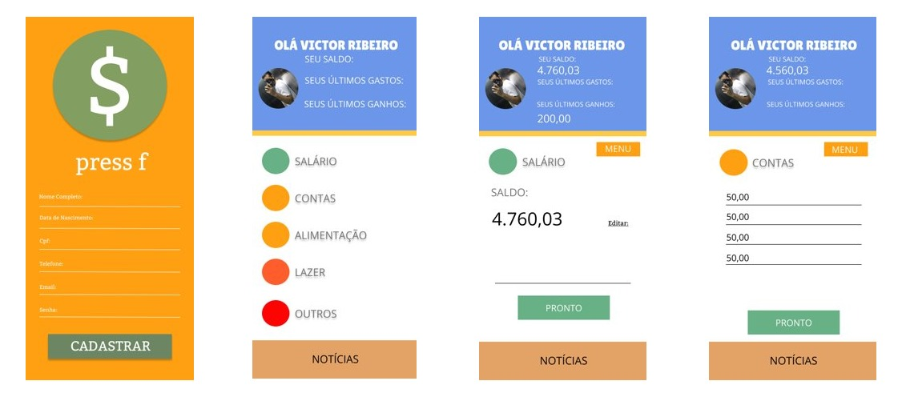
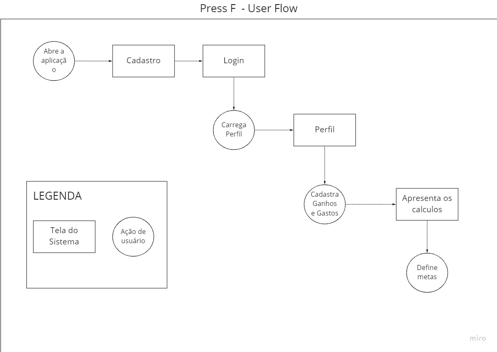

# Informações do Projeto 

ADMINISTRAÇÃO DE FINANÇAS

-----------------------------

ENGENHARIA DE SOFTWARE

## Participantes

> Os membros do grupo são: 
> - Samuel Almeida Pinheiro 
> - Matheus Hoske Aguiar
> - Victor Fernando Marques Ribeiro
> - Lucas Garibaldi Albuqueruqe Bahia

# Estrutura do Documento

- [Informações do Projeto](#informações-do-projeto)
  - [Participantes](#participantes)
- [Estrutura do Documento](#estrutura-do-documento)
- [Introdução](#introdução)
  - [Problema](#problema)
  - [Objetivos](#objetivos)
  - [Justificativa](#justificativa)
  - [Público-Alvo](#público-alvo)
- [Especificações do Projeto](#especificações-do-projeto)
  - [Personas e Mapas de Empatia](#personas-e-mapas-de-empatia)
  - [Histórias de Usuários](#histórias-de-usuários)
  - [Requisitos](#requisitos)
    - [Requisitos Funcionais](#requisitos-funcionais)
    - [Requisitos não Funcionais](#requisitos-não-funcionais)
  - [Restrições](#restrições)
- [Projeto de Interface](#projeto-de-interface)
  - [User Flow](#user-flow)
  - [Wireframes](#wireframes)
- [Metodologia](#metodologia)
  - [Divisão de Papéis](#divisão-de-papéis)
  - [Ferramentas](#ferramentas)
  - [Controle de Versão](#controle-de-versão)
- [**############## SPRINT 1 ACABA AQUI #############**](#-sprint-1-acaba-aqui-)
- [Projeto da Solução](#projeto-da-solução)
  - [Tecnologias Utilizadas](#tecnologias-utilizadas)
  - [Arquitetura da solução](#arquitetura-da-solução)
- [Avaliação da Aplicação](#avaliação-da-aplicação)
  - [Plano de Testes](#plano-de-testes)
  - [Ferramentas de Testes (Opcional)](#ferramentas-de-testes-opcional)
  - [Registros de Testes](#registros-de-testes)
- [Referências](#referências)

# Introdução

## Problema

Um dos grandes problemas do mundo moderno é a gestão de finanças. Com os custos de vida cada vez mais elevados e a necessidade de conciliar o que fundamental com o que é luxo, varias pessoas acabam realizando uma má gestão financeira e com isso contraindo dividas e custos indesejados.

## Objetivos

Nosso principal objetivo é de ajudar os nossos usuários a equilibrarem suas finanças, melhorando a qualidade de vida dos mesmos. Acreditamos que, o quão mais equilibrada estiver a vida financeira da pessoa, melhor será sua vida pessoal.

## Justificativa

......  COLOQUE AQUI O SEU TEXTO ......

> Descreva a importância ou a motivação para trabalhar com esta aplicação
> que você escolheu. Indique as razões pelas quais você escolheu seus
> objetivos específicos ou as razões para aprofundar em certos aspectos
> do software.
> 
> O grupo de trabalho pode fazer uso de questionários, entrevistas e
> dados estatísticos, que podem ser apresentados, com o objetivo de
> esclarecer detalhes do problema que será abordado pelo grupo.
>
> **Links Úteis**:
> - [Como montar a justificativa](https://guiadamonografia.com.br/como-montar-justificativa-do-tcc/)

## Público-Alvo

Nosso público alvo consistirá em pessoas jovens e adultas que possuem no mínimo uma fonte de renda.
 
# Especificações do Projeto

Serão utilizadas as linguagens JavaScript, CSS e a framework Bootstrap para a concepção do projeto. 

## Personas e Mapas de Empatia

Com base em nossas pesquisas, conseguimos gerar as seguintes Personas: 

> 
> 
> 

## Histórias de Usuários

Com base na análise das personas forma identificadas as seguintes histórias de usuários:

|EU COMO... `PERSONA` | QUERO/PRECISO ... `FUNCIONALIDADE`               |PARA ... `MOTIVO/VALOR`                                             |
|-------------------------|--------------------------------------------------|----------------------------------------------------------------|
|Usuário do sistema       | Registrar meus ganhos e gastos no app            | Ter um melhor controle sob minha vida financeira               |
|Consultor Financeiro     | Obter informações sobre movimentações do usuário | Permitir que possa ser feita uma consultoria para cada cliente |
|Administrador do Sistema | Obter informações sobre do usuário no sistema    | Consertar erros e bugs que venham a ocorrer                    |

## Requisitos

As tabelas que se seguem apresentam os requisitos funcionais e não funcionais que detalham o escopo do projeto.

### Requisitos Funcionais

|ID    | Descrição do Requisito  | Prioridade |
|------|-----------------------------------------|----|
|RF-001| Permitir que o usuário cadastre gastos e ganhos                    | ALTA | 
|RF-002| Permitir que o usuário defina metas                                | ALTA |
|RF-003| Permitir que o usuario ao cadastrar tarefa, marquea como redutivel | MÉDIA |
|RF-004| Cadastro de usuário na plataforma                                  | ALTA |
|RF-005| Definição de objetivo do usuário durante o cadastro                | MÉDIA |
|RF-006| Criar aba de investimentos                                         | BAIXA |
|RF-007| Criar aba de noticias do mercado                                   | BAIXA |

### Requisitos não Funcionais

|ID     | Descrição do Requisito  |Prioridade |
|-------|-------------------------|----|
|RNF-001| O sistema deve ser responsivo para rodar em um dispositivos móvel | ALTA | 
|RNF-002| Deve processar requisições do usuário em no máximo 3s | BAIXA | 
|RNF-003| O sistema deverá utilizar-se de banco relacional para cadastro dos usuários | MEDIA | 

## Restrições

O projeto está restrito pelos itens apresentados na tabela a seguir.

|ID| Restrição                                             |
|--|-------------------------------------------------------|
|01| O projeto deverá ser entregue até o final do semestre |
|02| Não pode ser desenvolvido um módulo de backend        |
|03| Restrito a javascript, HTML e CSS                     |
|04| Evitar alta complexidade                              |

# Projeto de Interface

|Protótipo Interativo | Figma | https://www.figma.com/file/VgyE6AaKPmRLDdE6hFSvcE/Untitled?node-id=0%3A1 |

## User Flow

> 

## Wireframes

# Metodologia

Utilizamos a metodologia do Scrum para organizar o projeto, as funções foram determinadas por consenso entre os integrantes do grupo.

## Divisão de Papéis

|Nome| Função                                     |
|---------------------------------|---------------|
|Samuel Almeida Pinheiro          | Scrum Master  |
|Matheus Hoske Aguiar             | Programador   |
|Victor Fernando Marques Ribeiro  | Designer      |
|Lucas Garibaldi Albuqueruqe Bahia| Entrevistador |

## Ferramentas

......  COLOQUE AQUI O SEU TEXTO - SIGA O EXEMPLO DA TABELA ABAIXO  ......

| Ambiente  | Plataforma              |Link de Acesso |
|-----------|-------------------------|---------------|
|Processo de Design Thinkgin  | Miro | https://miro.com/app/board/uXjVOA2Deks=/ | 
|Repositório de código | GitHub | https://github.com/ICEI-PUC-Minas-PPLES-TI/plf-es-2022-1-ti1-7946100-g9-adm-de-financas | 
|Hospedagem do site | Repl.it | https://admfinancastiaw.matheushoske.repl.co/login.html |
|Protótipo Interativo | Figma | https://www.figma.com/file/VgyE6AaKPmRLDdE6hFSvcE/Untitled?node-id=0%3A1 | 
|Editor de código | Visual Studio Code | --- | 
|Ferramentas de comunicação | Discord | --- | 

## Controle de Versão

O controle de versão será feito a partir da plataforma GitHub, seguinte convenção para o nome de branchs:
- `master`: versão estável já testada do software
- `testing`: versão em testes do software
- `dev`: versão de desenvolvimento do software

Quanto à gerência de issues, o projeto adota a seguinte convenção para etiquetas:
- `bugfix`: uma funcionalidade encontra-se com problemas
- `enhancement`: uma funcionalidade precisa ser melhorada
- `feature`: uma nova funcionalidade precisa ser introduzida

# Projeto da Solução

Como projeto de solução iremos desenvolver uma aplicação Web que irá auxiliar nossos usuários na organização de suas finanças

## Tecnologias Utilizadas

As tecnologias utilizadas serão HTML, CSS e JavaScript
Framework BootsTrap
Ide Visual Studio e Visual Studio Code

O usuário passará apenas pelas telas de Login e cadastro, antes de ser direcionado a tela principal, onde podera cadastrar seus gastos e ganhos, e por la controla-los

## Arquitetura da solução

O site estara hospedado na Web atraves do github pages

> Inclua um diagrama da solução e descreva os módulos e as tecnologias
> que fazem parte da solução. Discorra sobre o diagrama.
> 
> **Exemplo do diagrama de Arquitetura**:
> 
> 

# Avaliação da Aplicação

......  COLOQUE AQUI O SEU TEXTO ......

> Apresente os cenários de testes utilizados na realização dos testes da
> sua aplicação. Escolha cenários de testes que demonstrem os requisitos
> sendo satisfeitos.

## Plano de Testes

| Caso de Teste | Ação | Resultado esperado |
|---------------|------|--------------------|
| Teste de Login | Efetuar Login no site | Login e senha autenticados no banco e redirecionamento a tela principal | 
| Teste de Cadastro | Efetuar Cadastro no site | Informações gravadas no Local Storage | 
| Teste de Responsividade | Ajustar tamanho da aba para 412 x 915 | A pagina ajusta sua visualização |
| Teste de Calculo | Cadastrar Ganhos e gastos | Calculo de saldo sendo apresentado corretamente | 

## Registros de Testes

Todos oos testes ocorreram como o esperado por serem simples de terem seus resultados adquiridos

# Referências

......  COLOQUE AQUI O SEU TEXTO ......

> Inclua todas as referências (livros, artigos, sites, etc) utilizados
> no desenvolvimento do trabalho.
> 
> **Links Úteis**:
> - [Formato ABNT](https://www.normastecnicas.com/abnt/trabalhos-academicos/referencias/)
> - [Referências Bibliográficas da ABNT](https://comunidade.rockcontent.com/referencia-bibliografica-abnt/)
